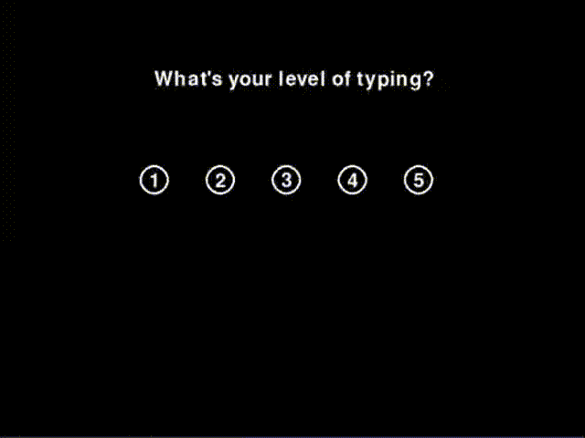
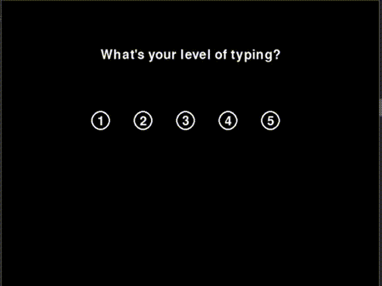
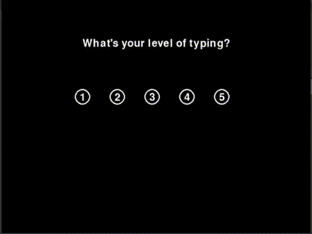
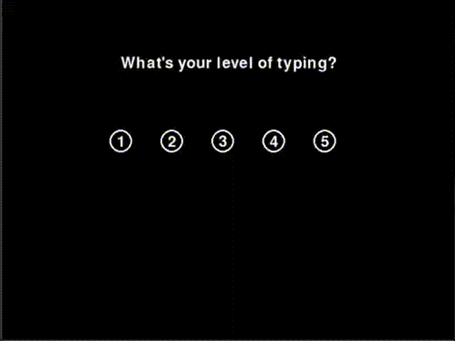
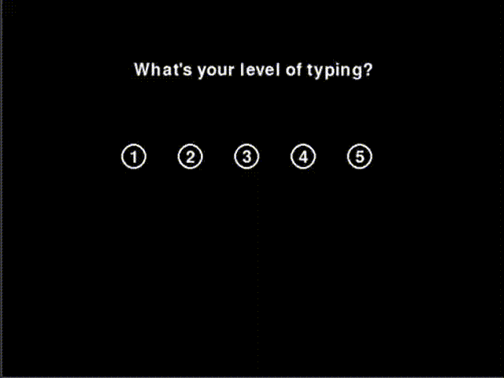
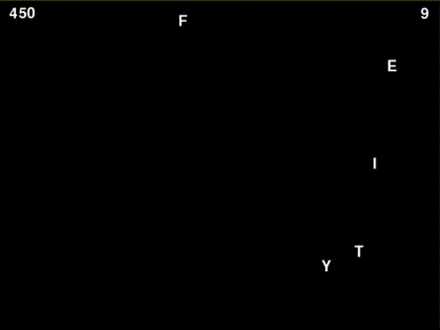
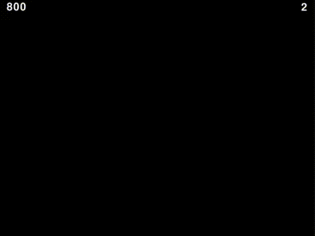

## Typing Game(What a Boring Name!)

> Created with Python + Pygame

 

There are 5 different difficulties. No matter how fast you can type I believe you will enjoy this game.

### Level 1

### Level 2

### Level 3

### Level 4

### Level 5

> update: Level 5 is faster than the demo here. Enjoy it!

## Special Letters

### Freeze(Blue)

If you eliminate a blue letter, all letters currently shown in the screen will be much slower(almost stops) please use it wisely! 

> Possibility: 10%

### Explode(Red)

If you eliminate a red letter, all letters currently shown in the screen will be eliminated. The tip here is to try not to die before a red letter shows up.Good Luck! 

> Possibility: 2%
